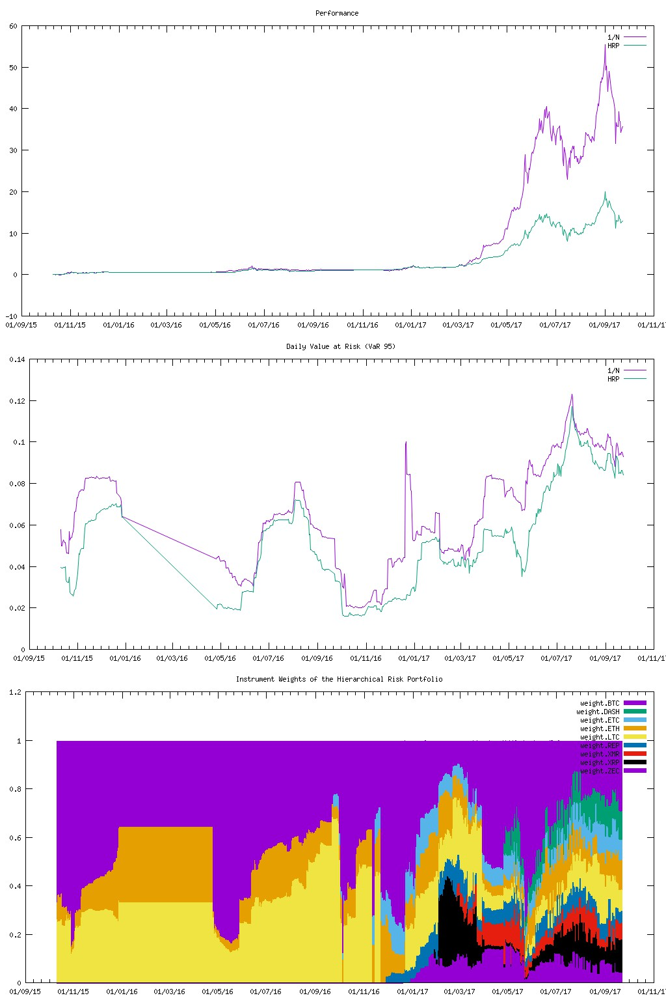

## Hierarchical Risk Parity (HRP) approach
This is an implemenatation of a new approach to optimize Portfolios called [Hierarchical Risk Parity (HRP) approach](https://papers.ssrn.com/sol3/papers.cfm?abstract_id=2708678). 
The implementation is written in java/groovy and applied to a couple of crypto currencies. Before you ask, I did this mainly for pure fun.




## Requirements
* JRE 8
* maven 3
* Groovy >= 2.4.7
* gnuplot installed and in the PATH variable

## Build
1. recoursively clone the repository  (you also need to fetch the submodule)<br>`git clone --recursive https://github.com/KIC/hrp.git`
2. build the hierarchical-clustering-java module first 
```
cd hierarchical-clustering-java
mvn clean install
```
3. build the main module (@gradlers: yes "install" not "build")
```
cd ..
./gradlew clean install
```
4. now everything is in maven cache and we can simply run the groovy script
```
cd build/groovy
groovy HierarchicalRiskPortfolio.groovy
```
