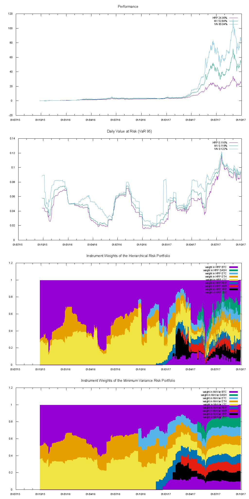
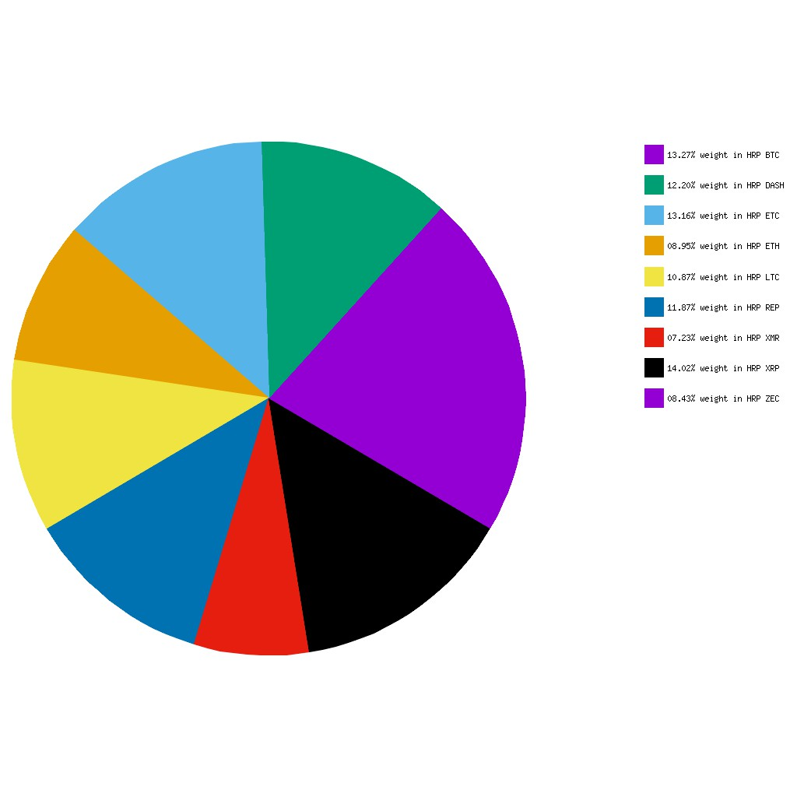

## Hierarchical Risk Parity (HRP) approach
Here is an implementation of the [Hierarchical Risk Parity (HRP) approach](https://papers.ssrn.com/sol3/papers.cfm?abstract_id=2708678).
HRP portfolios address three major concerns of quadratic optimizers in general and Markowitz’s CLA in particular: 
* Instability
* concentration 
* and underperformance.

The implementation is written in java/groovy and applied to a couple of crypto currencies. Before you ask, I did this mainly for pure fun.

This chart compares the Value at Risk 95 as well as the historical Performance of the follwoing Portfolios
* 1/N portfolio (meaning equally distributed)
* a [mean variance portfolio](https://www.linux.ime.usp.br/~cef/mac499-01/monografias/fdias/QP.pdf) with risk tolerance zero (aka minimum variance portfolio) 
* and the HRP Portfolio. 



As part of the output you will also get the most recent weights. Data is beeing fetched from [cryptocompare](https://www.cryptocompare.com/api/#-api-data-histoday-), the values are based on 00:00 GMT time


Note that there is also [Stooq](https://stooq.com/db/h/) source available using `new Stooq.getHistData(symbol, needBar=true, needVolume=false)` if you prefer investing into Stocks :-) 

## Requirements
* JRE 8
* maven 3
* Groovy >= 2.4.7
* gnuplot >= 5.0 installed and in the PATH variable
* mplayer (mencoder) installed and in the PATH variable

## Build
1. recoursively clone the repository  (you also need to fetch the submodule)<br>`git clone --recursive https://github.com/KIC/hrp.git`
2. build the hierarchical-clustering-java module first 
```
cd hierarchical-clustering-java
mvn clean install
```
3. build the main module (@gradlers: yes "install" not "build")
```
cd ..
./gradlew clean install
```
4. now everything is in maven cache and we can simply run the groovy script
```
cd build/groovy
groovy HierarchicalRiskPortfolio.groovy
```

## Todo
* Currently we assume a cost free daily rebalancing. The next step is to enable Rebalancing on different time frames and 
instroduce transaction costs 
* Allow to use differnet covariance estimation i.e. EWMA Based Covariance 
* Allow Rebalancing to happen not only on time but also on eventls like if my portfolio value dropped x% then rebalance
* Mix in other assets into the portfolio like gold